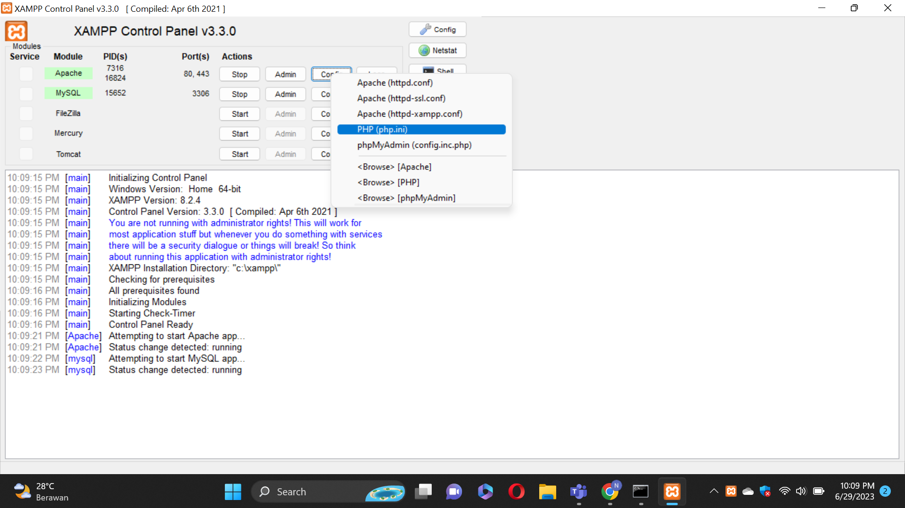
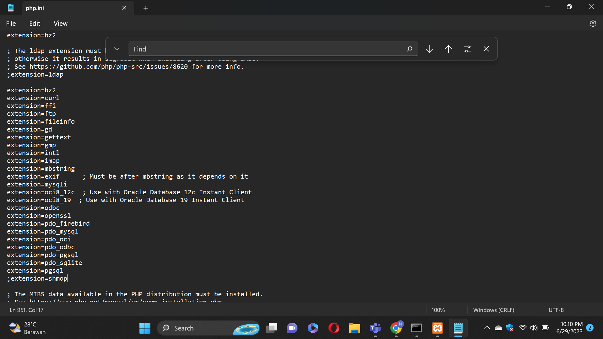
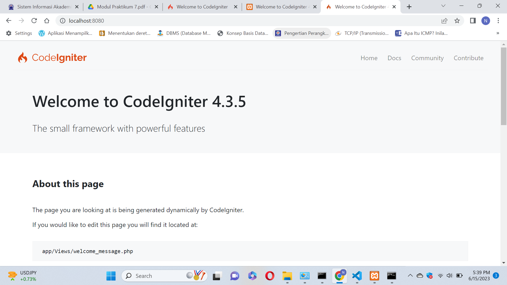
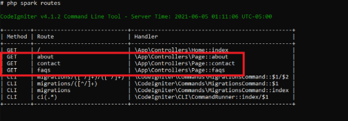
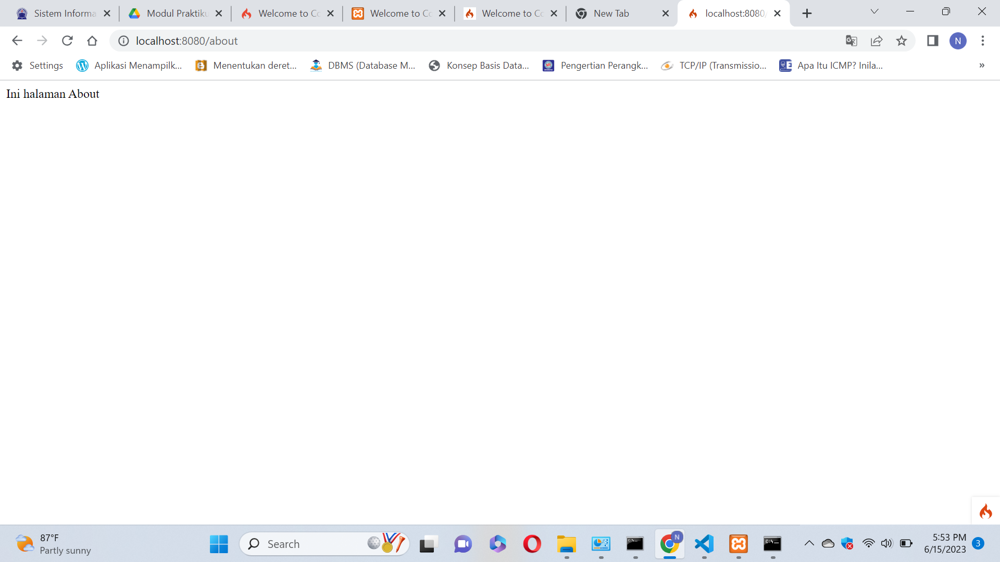
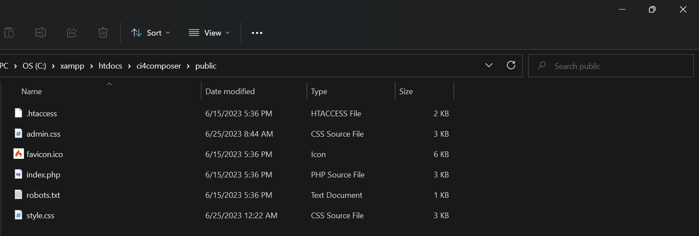
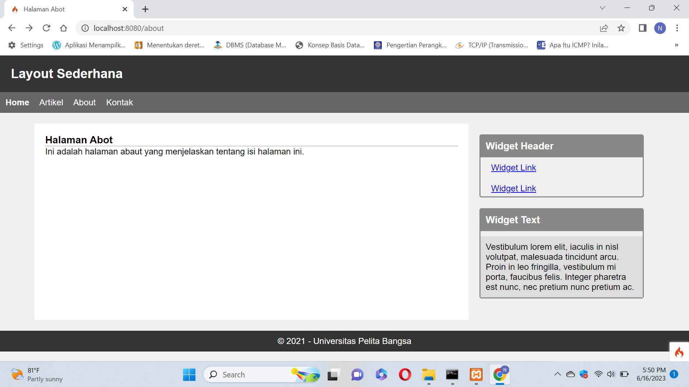

# Lab7Web

### Nurul Fajri - 312110506

### TI.21.C.1

## PHP FRAMEWORK (CODEIGNITER)

## LANGKAH LANGKAH PRAKTIKUM

Buka XAMPP,pada bagian Apache klik Config (PHP.ini)'
'

Pada bagian extention, hilangkan tanda ; (titik koma) pada ekstensi yang akan diaktifkan.'
'
Kemudian simpan kembali filenya dan restart Apache web server.'
'

•Unduh CODEIGNITER 4 '
'
•Extrak file zip Codeigniter ke direktori htdocs/.'
'
• Ubah nama direktory framework-4.x.xx menjadi ci4. '
'
• Buka browser dengan alamat http://localhost/lab11_ci/ci4/public/ '
'

Buka CMD lalu arahkan lokasi direktori sesuai dengan direktori kerja project yang dibuat 
Perintah untuk memanggil CLI CODEIGNITER adalah'
'
php spark'
'

Mengaktifkan Mode Debugging '
'
Codeigniter 4 menyediakan fitur debugging untuk memudahkan developer untuk mengetahui pesan
error apabila terjadi kesalahan dalam membuat kode program.'
'
Secara default fitur ini belum aktif. Ketika terjadi error pada aplikasi akan ditampilkan pesan
kesalahan seperti berikut.'
'

Ubah nama file env menjadi .env kemudian buka file tersebut dan ubah nilai variabel CI_ENVIRINMENT menjadi development.'
'

Untuk mengetahui route yang ditambahkan sudah benar, buka CLI (php spark routes)'
'

Selanjutnya adalah membuat Controller Page. Buat file baru dengan nama page.php pada direktori
Controller kemudian isi kodenya seperti berikut.'
'

Ini adalah hasilnya'
'

Secara default fitur autoroute pada Codeiginiter sudah aktif.'
'
Untuk mengubah status autoroute dapat mengubah nilai variabelnya. '
'
Untuk menonaktifkan ubah nilai true menjadi false.'
'
{$routes->setAutoRoute(true);} '
'
Tambahkan method baru pada Controller Page seperti berikut. '
'
public function tos()'
'
{'
'
echo "ini halaman Term of Services";'
'
}'
'

Selanjutnya adalam membuat view untuk tampilan web agar lebih menarik. Buat file baru dengan
nama about.php pada direktori view (app/view/about.php)'
'
Ubah method about pada class Controller Page menjadi seperti berikut:'
'

Ini adalah Hasilnya

Buat file css pada direktori public dengan nama style.css'
'

Kemudian buat folder template pada direktori view kemudian buat file header.php dan footer.php
File app/view/template/header.php'
'

Selanjutnya refresh tampilan pada alamat http://localhost:8080/about '
'
Ini adalah hasilnya '
'

